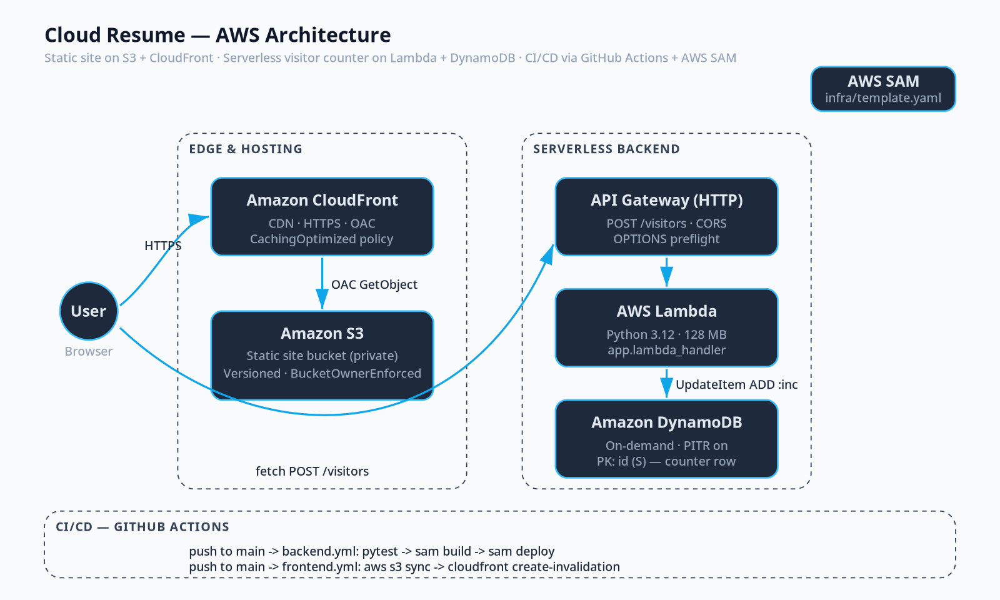

# Cloud Resume — AWS

A serverless, fully-automated personal resume site built on AWS.



## What it demonstrates

- **Static hosting** on Amazon S3 with a private, versioned bucket.
- **Global delivery** through CloudFront with HTTPS and Origin Access Control (OAC).
- **Serverless API** — Python 3.12 Lambda fronted by HTTP API Gateway, with CORS.
- **NoSQL persistence** — DynamoDB visitor counter (atomic `UpdateItem ADD`).
- **Infrastructure as Code** — every resource defined in [`infra/template.yaml`](infra/template.yaml) (AWS SAM).
- **CI/CD** — two GitHub Actions workflows ([backend](.github/workflows/backend.yml), [frontend](.github/workflows/frontend.yml)) deploy on every push to `main` using short-lived OIDC credentials (no long-lived AWS keys in GitHub).
- **Tested** — pytest + moto unit tests for the Lambda handler.

## TODO 2026-05-11
Test out CI/CD github actions
Log the tests
Rebuild project with nextjs/react

## Repo layout

```
cloud-portfolio/
├── frontend/          # static site (HTML/CSS/JS)
│   ├── index.html
│   ├── css/styles.css
│   └── js/main.js
├── backend/           # Lambda handler + tests
│   ├── src/app.py
│   └── tests/test_app.py
├── infra/             # AWS SAM template (single-stack)
│   ├── template.yaml
│   └── samconfig.toml
├── .github/workflows/ # CI/CD
│   ├── backend.yml
│   └── frontend.yml
└── docs/
    ├── RUNBOOK.md     # step-by-step setup
    ├── BLOG_POST.md   # publishable write-up
    └── architecture.svg
```

## Quick start

1. Read [`docs/RUNBOOK.md`](docs/RUNBOOK.md) — it walks you through AWS account hardening, GitHub OIDC, and the first deploy.
2. After the SAM stack deploys, copy `VisitorCounterApiUrl` from the stack outputs into [`frontend/js/main.js`](frontend/js/main.js) (replace `REPLACE_ME`).
3. Push to `main` — GitHub Actions takes it from there.

## Live site

> _Once deployed, the CloudFront URL appears in the SAM stack outputs as `CloudFrontDomainName`._

## License

MIT — feel free to fork and adapt for your own resume.
